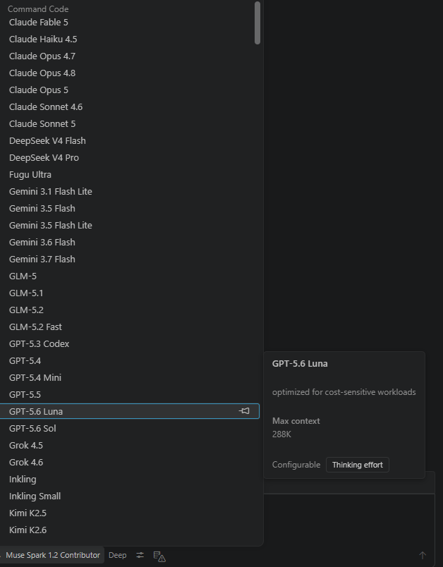

# Command Code for Copilot Chat

Pick Command Code models from the Copilot Chat model picker — and keep everything else Copilot already gives you.

**Love Command Code's price-performance but don't want to give up GitHub Copilot's agent mode, tool calling, and polished UI?** This extension drops every Command Code model straight into the Copilot Chat model selector — with **vision**, **thinking mode**, and your own API key.

## Why this extension?

- **Don't replace Copilot — power it up.** No new sidebar, no new chat UI to learn. Just a new set of models in the picker you already use.
- **Agent mode, tool calling, instructions, MCP, skills — all of it still works.** Copilot's entire stack, now running on any Command Code model.
- **Native vision.** Command Code serves Claude, GPT, Gemini, Kimi, Qwen, and Grok models with native image input — no proxy required.
- **BYOK, pay Command Code directly.** Your API key, your bill, your rate limits. Stored in the OS keychain, never on disk.

## Features

### Every Command Code model in the model picker

The full Command Code Provider catalog is exposed alongside GPT-4o, Claude, and friends in Copilot Chat's model selector — Claude Opus 5, Claude Sonnet 5, GPT-5.5/5.6, Gemini 3.7 Flash, DeepSeek V4 Pro/Flash, Kimi K3, Qwen 3.8 Max, GLM-5.3, Grok 4.6, and dozens more. Switch models mid-chat without losing history.

### Thinking effort per model

Each reasoning-capable model exposes a **Thinking effort** dropdown directly in the Copilot picker:

- `Off` — disable thinking for fastest responses
- `Light` — light reasoning for quick edits
- `Standard` — recommended for everyday use
- `Deep` — deep reasoning for complex tasks

The setting is sent to the upstream as `reasoning_effort` and applies only when the model is selected — no global toggle to forget about.

### Native vision input

Vision-capable models (Claude Opus/Sonnet 5, GPT-5.4+, Gemini, Kimi K3, Qwen 3.7+, Grok 4.5, and more) receive image attachments directly — no proxy, no description round-trip, no latency tax.

<p align="center">
  
</p>

### Inherits every Copilot capability

Because this plugs into Copilot's native provider API, you get the full stack for free:

- **Agent mode** — autonomous multi-step tasks
- **Tool calling** — file edits, terminal, workspace search, Git, tests
- **Instructions & skills** — all your `.instructions.md`, `AGENTS.md`, and skills just work
- **Zero-data-retention** — opt in with one setting; requests route only through ZDR-capable upstreams

### Secure by default

API key lives in VS Code's `SecretStorage` (OS keychain on Windows / macOS / Linux). Never in `settings.json`, never in your Git history.

### Zero runtime dependencies

Pure VS Code API + Node.js built-ins. No Python, no Docker, no local proxy server.

## Getting Started

### Prerequisites

- VS Code 1.116 or later (this extension relies on the same Copilot Chat provider API surface as upstream)
- GitHub Copilot subscription (Free / Pro / Enterprise — the free tier works)
- Command Code subscription that includes API access (GOAT, Pro, Max, Team, or Provider) — see [pricing](https://commandcode.ai/docs/resources/pricing-limits)

### Installation

1. **VS Code** — install from the [Visual Studio Marketplace](https://marketplace.visualstudio.com/items?itemName=Tyrannmisu.commandcode-copilot-provider) (once published).
2. **Editors on Open VSX** — install from [Open VSX](https://open-vsx.org/extension/Tyrannmisu/commandcode-copilot-provider) (once published).

### Usage

1. Run **Command Code: Set API Key** from the Command Palette (`Ctrl+Shift+P`).
2. Paste your Command Code API key (from [Studio](https://commandcode.ai/studio/)).
3. Open Copilot Chat, click the model picker, pick any **Command Code** model.
4. Pick a **Thinking effort** from the dropdown next to the model name.
5. Chat away.

## Models

The provider ships the full Command Code catalog, grouped by company. The most popular picks:

| Model                | Thinking effort               | Vision | Best for                                |
| -------------------- | ----------------------------- | ------ | --------------------------------------- |
| **Claude Sonnet 5**  | Off / Light / Standard / Deep | ✅     | Best combo of speed & intelligence      |
| **Claude Opus 5**    | Off / Light / Standard / Deep | ✅     | Most intelligent Opus                   |
| **GPT-5.5**          | Off / Light / Standard / Deep | ✅     | Latest OpenAI frontier                  |
| **Gemini 3.7 Flash** | Off / Light / Standard / Deep | ✅     | Coding & agentic workflows              |
| **DeepSeek V4 Pro**  | Off / Light / Standard / Deep | —      | Hybrid-attention long-context reasoning |
| **Qwen 3.7 Plus**    | Off / Light / Standard / Deep | ✅     | Agentic coding at lower cost            |
| **Kimi K3**          | Off / Light / Standard / Deep | ✅     | 1M context knowledge work               |
| **Grok 4.5**         | Off / Light / Standard / Deep | ✅     | Smartest xAI for coding                 |
| **GLM-5.3**          | Off / Light / Standard / Deep | —      | Frontier coding with 1M context         |

The full list (40+ models across 14 providers) is in [`src/models.ts`](src/models.ts).

## Settings

| Setting                                | Default                                  | Description                                                                                           |
| -------------------------------------- | ---------------------------------------- | ----------------------------------------------------------------------------------------------------- |
| `commandcode-copilot.baseUrl`          | `https://api.commandcode.ai/provider/v1` | API endpoint — change for self-hosted / proxied deployments                                           |
| `commandcode-copilot.maxTokens`        | `0`                                      | Max output tokens (`0` = no limit). Useful for cost control                                           |
| `commandcode-copilot.zdr`              | `false`                                  | Send `x-cmdc-zdr: 1` on every request to enforce zero-data-retention routing                          |
| `commandcode-copilot.modelIdOverrides` | `{}`                                     | Map VS Code model ids to different API ids (for mirrors that rename models)                           |
| `commandcode-copilot.modelBlacklist`   | `[]`                                     | Hide specific model ids from the picker                                                               |
| `commandcode-copilot.maxContextTokens` | `0`                                      | Override the context window reported to Copilot (`0` = use model default)                             |
| `commandcode-copilot.apiKey`           | _(unset)_                                | API key fallback (settings-based; SecretStorage wins)                                                 |
| `commandcode-copilot.debugMode`        | `minimal`                                | Diagnostic verbosity: `minimal` (silent), `metadata` (per-request summary), `verbose` (full payloads) |

Thinking effort is configured from Copilot Chat's model picker for each Command Code model.

Example `settings.json` for a mirror that renames models:

```json
{
  "commandcode-copilot.baseUrl": "https://my-mirror.example.com/v1",
  "commandcode-copilot.modelIdOverrides": {
    "claude-sonnet-5": "claude-sonnet-5-mirror",
    "gpt-5.5": "gpt-5-5-mirror"
  }
}
```

Example `settings.json` for zero-data-retention:

```json
{
  "commandcode-copilot.zdr": true
}
```

## License

[MIT](LICENSE)
